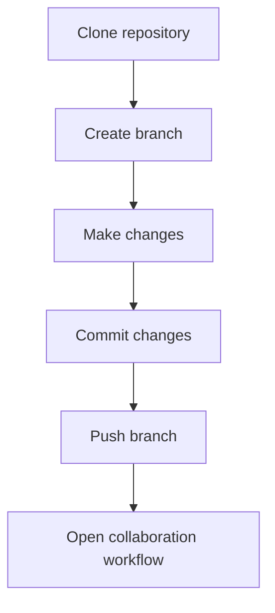

# Chithra Akura 2024

Upgraded website portal for the Chithra Akura '24 project.

## Project

Chithra Akura is a Royal College Art Circle project created to support art education, creative exploration, and student collaboration.

## Credits

### Fonts

- [DM Sans](https://fonts.google.com/specimen/DM+Sans)
- [Abhaya Libre](https://fonts.google.com/specimen/Abhaya+Libre)
- [Noto Sans Sinhala](https://fonts.google.com/noto/specimen/Noto+Sans+Sinhala)

### Image Sources

- Main image: [VFX of Nim](https://www.artstation.com/artwork/XBbXo3)
- Lesson images: [Alamy Photos](https://www.alamy.com)

## Getting Started

Install [Git](https://git-scm.com/downloads) and create a [GitHub](https://github.com/) account. Sign in to GitHub through VS Code.

For additional guidance, watch this [Git and GitHub tutorial playlist](https://www.youtube.com/playlist?list=PL4cUxeGkcC9goXbgTDQ0n_4TBzOO0ocPR).

Open the VS Code terminal with <kbd>Ctrl</kbd> + <kbd>J</kbd>, then navigate to the project directory:

```sh
cd D:/art-circle/chithra-akura-new
```

Clone the repository:

```sh
git clone <repository-url>
```

Create a working branch:

```sh
git checkout -b <branch-name>
```

## Editing Workflow

Check the active branch before making or committing changes:

```sh
git branch
```

After editing, stage and commit the changes:

```sh
git add .
git commit -m "short title for your changes"
```

Push the branch to the remote repository:

```sh
git push origin <your-branch-name>
```

For questions or uncertain changes, ask for assistance before proceeding.

## Workflow


